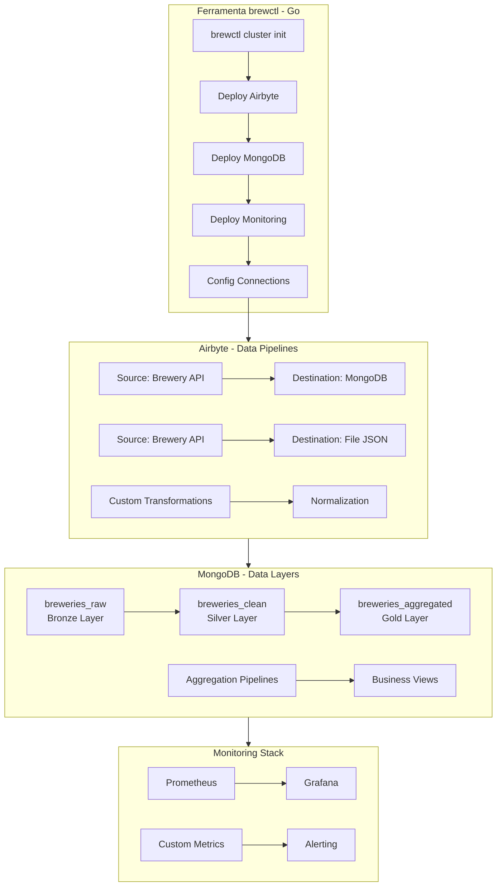

# BrewCtl - Pipeline de Dados de Cervejarias

## 📖 Introdução

O BrewCtl é uma ferramenta de linha de comando (CLI) escrita em Go que automatiza a criação de um pipeline de dados completo para dados de cervejarias. Ele coleta dados da Open Brewery DB API, armazena em um banco de dados MongoDB e fornece ferramentas de monitoramento com Prometheus e Grafana.

## 🚀 Funcionalidades

- **Criação de Cluster Kubernetes**: Utiliza Kind para criar um cluster local
- **Deploy do MongoDB**: Instala o MongoDB usando Helm ou implanta uma imagem oficial como fallback
- **Deploy do Airbyte**: Configura o Airbyte para ingestão de dados
- **Monitoramento**: Instala Prometheus e Grafana para monitoramento do cluster e dos dados
- **Importação de Dados**: Conecta-se à Open Brewery DB API e importa dados de cervejarias
- **Aggregações no MongoDB**: Fornece exemplos de agregações para análise dos dados

## 📊 Análise da Fonte de Dados (Open Brewery DB API)

A API Open Brewery DB é bem estruturada e oferece endpoints que permitem uma coleta abrangente de dados. Abaixo está um resumo dos endpoints mais relevantes para o nosso pipeline:

| Endpoint | Descrição | Parâmetros Relevantes | Utilidade no Pipeline |
|----------|-----------|----------------------|----------------------|
| **`/breweries`** | Lista todas as cervejarias, com paginação | `page`, `per_page` (max. 200) | Carga inicial e incremental (baseada em `id` e data de atualização) |
| **`/breweries/{id}`** | Obtém detalhes de uma cervejaria específica | `obdb-id` | Recuperar detalhes individuais, se necessário |
| **`/breweries/search`** | Busca cervejarias por um termo | `query` | Carga específica para testes ou casos de uso direcionados |
| **`/breweries/random`** | Retorna uma ou mais cervejarias aleatórias | `size` (max. 50) | Pode ser usado para gerar dados de teste diversificados |
| **`/breweries/meta`** | Retorna metadados sobre os resultados, como a contagem total | Mesmos filtros de listagem | Muito útil para planejar a paginação e monitorar o volume de dados |

**Considerações para o Pipeline:**

- Para uma carga completa, será necessário iterar por todas as páginas do endpoint `/breweries`
- Os filtros opcionais (como `by_city`, `by_state`, `by_type`) são valiosos para simular cargas incrementais ou para atender a consultas específicas no futuro
- O campo `brewery_type` é um enumerador fixo (e.g., `micro`, `nano`, `regional`), o que facilita seu uso como uma dimensão na camada semântica

## 🏗️ Estrutura do Projeto

.
├── brewctl\
├── cmd\
│   └── brewctl\
│       └── main.go\
├── deployments\
│   ├── airbyte-values.yaml\
│   ├── kind-config.yaml\
│   ├── mongodb-values.yaml\
│   └── monitoring-values.yaml\
├── go.mod\
├── go.sum\
├── internal\
│   ├── airbyte\
│   │   ├── client.go\
│   │   ├── connections.go\
│   │   └── deploy.go\
│   ├── brewerydb\
│   │   ├── client.go\
│   │   └── importer.go\
│   ├── kube\
│   │   ├── helm.go\
│   │   └── kind.go\
│   ├── mongodb\
│   │   ├── aggregations.go\
│   │   ├── aggregations_test.go\
│   │   └── client.go\
│   └── monitoring\
│       ├── grafana.go\
│       ├── monitoring.go\
│       └── prometheus.go\
├── pkg\
│   ├── types\
│   └── utils\
├── README.md\
└── scripts\
    ├── bash\
    ├── check-ports.sh\
    ├── health.sh\
    ├── mongodb-aggregations.js\
    ├── quick-start.sh\
    └── setup-and-run.sh\

### Descrição dos Diretórios

- **cmd/brewctl**: Contém o código principal da CLI
- **deployments**: Arquivos de configuração para os deployments no Kubernetes (Airbyte, MongoDB, Monitoramento) e configuração do Kind
- **internal**: Pacotes internos da aplicação
  - **airbyte**: Cliente e configurações para o Airbyte
  - **brewerydb**: Cliente e importador da Open Brewery DB API
  - **kube**: Funções para interagir com Kubernetes e Helm
  - **mongodb**: Cliente e agregações para o MongoDB
  - **monitoring**: Configurações para Prometheus e Grafana
- **pkg**: Pacotes que podem ser reutilizados (types e utils)
- **scripts**: Scripts auxiliares para setup, health check e agregações

## ⚙️ Configuração e Uso

### Comandos Principais

    ./brewctl create-cluster: Cria um cluster Kind

    ./brewctl deploy-mongodb: Instala o MongoDB

    ./brewctl deploy-airbyte: Instala o Airbyte

    ./brewctl deploy-monitoring: Instala o monitoring stack

    ./brewctl import-data: Importa dados da Open Brewery DB

### Pré-requisitos

- Go 1.19+
- Docker
- Kind
- Helm

## 📈 Agregações e Análises

O projeto inclui exemplos de agregações no MongoDB para análise dos dados, como contagem de cervejarias por estado, por tipo, etc. Essas agregações podem ser encontradas em internal/mongodb/aggregations.go e scripts/mongodb-aggregations.js.
🛠️ Desenvolvimento
Adicionando Novas Agregações

    Edite internal/mongodb/aggregations.go para adicionar a nova agregação

    Atualize os testes em internal/mongodb/aggregations_test.go

    Execute go test ./internal/mongodb para verificar

Estendendo a CLI

Novos comandos podem ser adicionados em cmd/brewctl/main.go e implementados nos pacotes internos.
